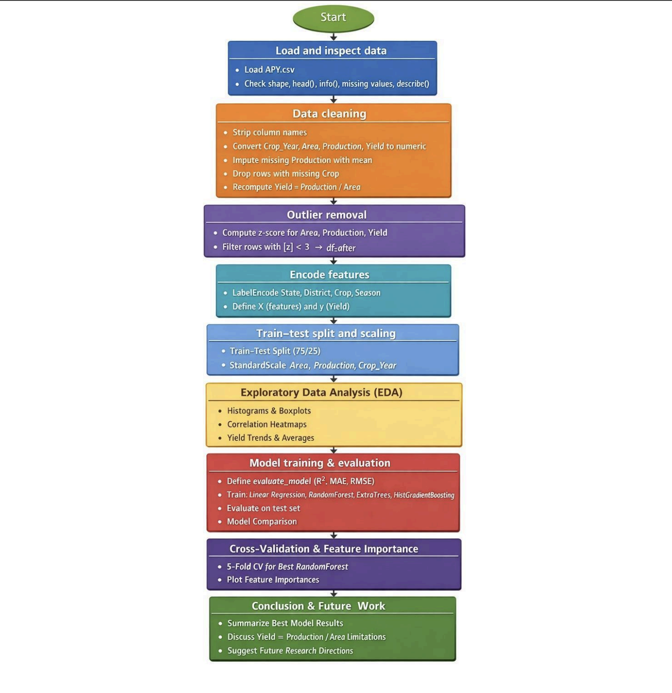
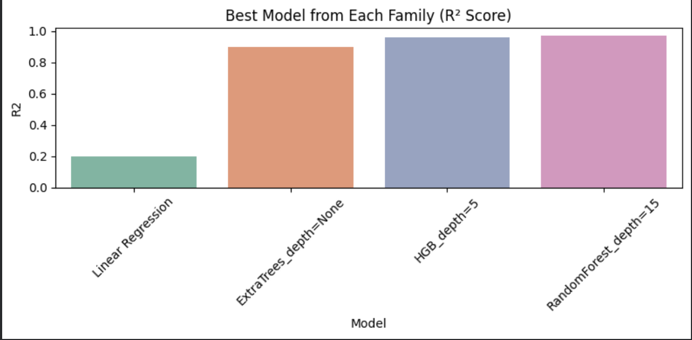

# Crop Yield Prediction using Ensemble Machine Learning

MSc Advanced Computer Science Masters Project  
University of Hertfordshire  

Student: Sandeep Kumar Yadav Gandu  
Student ID: 23067307  
Supervisor: Dr. Yar Muhammad  

---

## Project Overview

This project focuses on predicting crop yield in India using machine learning and ensemble-based models. Agriculture plays a critical role in India's economy, and accurate crop yield prediction can support better planning, food security, and policy decisions.

The project compares traditional statistical methods with modern machine learning algorithms to determine which models provide the most accurate predictions for crop yield.

---

## Dataset

The dataset used in this project is the **Crop Production Statistics – India dataset (APY.csv)** obtained from Kaggle.

It contains agricultural records including:

- State
- District
- Crop
- Crop Year
- Season
- Area cultivated
- Production
- Yield

The dataset includes over **170,000 records** of crop production data across Indian states.

---

## Project Workflow

The project follows a standard machine learning pipeline:

1. Data loading and inspection
2. Data cleaning and preprocessing
3. Outlier detection
4. Feature encoding and scaling
5. Model training and evaluation
6. Model comparison and interpretation

## Machine Learning Models Used

The following models were implemented and compared:

- Linear Regression (baseline)
- Random Forest Regressor
- Extra Trees Regressor
- Histogram Gradient Boosting Regressor

---

## Evaluation Metrics

Model performance was evaluated using:

- R² Score
- Mean Absolute Error (MAE)
- Root Mean Squared Error (RMSE)

---

## Key Results

The ensemble models significantly outperformed the baseline regression model.

Best performing model:

Random Forest Regressor  
R² Score ≈ 0.99

This demonstrates that ensemble learning methods can effectively capture complex nonlinear relationships in agricultural data.

---

## Technologies Used

Python  
Pandas  
NumPy  
Scikit-learn  
Matplotlib  
Seaborn  
Jupyter Notebook  

---

## Future Work

Future improvements may include:

- Adding climate variables such as rainfall and temperature
- Incorporating remote sensing data
- Using deep learning models
- Deploying the model as a predictive tool for agricultural planning

---

## Author

Sandeep Kumar Yadav Gandu  
MSc Data Science and Analytics 
University of Hertfordshire
